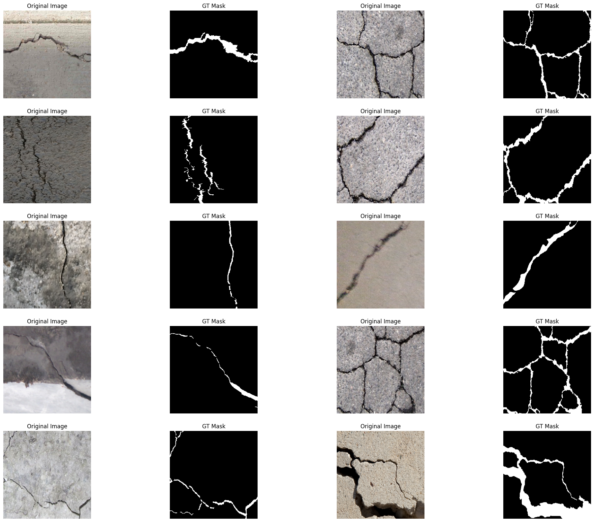
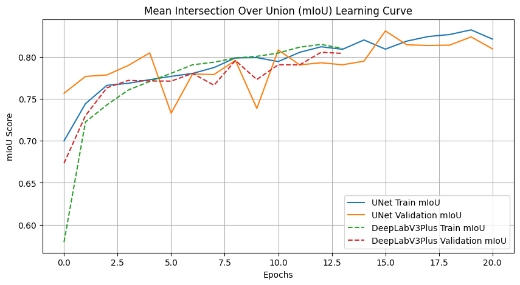
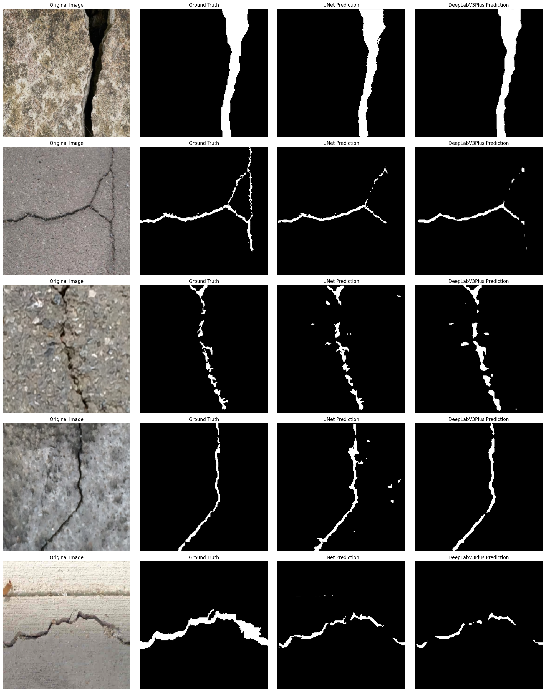

# 🧱 Crack Segmentation

> PyTorch semantic segmentation of surface cracks — a from-scratch **UNet** vs **DeepLabV3Plus**, with IoU/Dice metrics, an interactive Streamlit demo, and ONNX export.

<p align="center">
  
  
  
  
  
</p>

A deep learning project that segments **cracks** in surface images pixel by pixel (binary segmentation: crack vs background). It trains and compares two architectures — a **UNet built from scratch** and a library **DeepLabV3Plus** — on the [DeepCrack](https://www.kaggle.com/datasets/rukiyeaydn/deepcrack-dataset) dataset, reports IoU / Dice / pixel-accuracy, and ships an interactive Streamlit demo plus ONNX export for deployment.

## Features

- **Custom dataset** loader for paired image/mask folders (`train_img`/`train_lab`, `test_img`/`test_lab`).
- **Two models**: a hand-written **UNet** (`model.py`) and **DeepLabV3Plus** from `segmentation_models_pytorch`.
- **albumentations** augmentation pipeline (resize, flip, normalize).
- **Training loop** with mIoU / pixel-accuracy tracking, early stopping, and best-model saving.
- **Reports**: dataset samples, learning-curve comparison, UNet-vs-DeepLab inference grid.
- **Streamlit demo** with live model switching, ground-truth comparison, **IoU/Dice scoring**, and a colour-coded match map (correct / missed / false alarm).
- **ONNX export** for both models with a PyTorch-vs-ONNX verification step.

## Results

Trained on DeepCrack (300 train images, 237 test images) at 256×256, `CrossEntropyLoss`, Adam `lr=3e-4`, early stopping.

| Model | Val Pixel Acc | Val mIoU | Notes |
|-------|:-------------:|:--------:|-------|
| **UNet** (from scratch) | ~0.986 | ~0.83 | `up_method="tr_conv"` |
| **DeepLabV3Plus** (smp) | ~0.983 | ~0.81 | pretrained encoder |

> mIoU here is the mean over both classes. In the demo, the score shown is the **crack-class IoU** (background is excluded, since it trivially scores ~0.98 and would inflate the number).

**Dataset samples**


**Learning-curve comparison (UNet vs DeepLabV3Plus)**


**Inference comparison** — Original · Ground truth · UNet · DeepLabV3Plus


## Project Structure

```
crack_segmentation/
├── downloader.py          # download DeepCrack via kagglehub -> datasetlar/cracks
├── custom_dataset.py      # CrackDataset + get_dls() (train/val/test loaders)
├── model.py               # UNet built from scratch (encoder/decoder blocks)
├── train.py               # Metrics + Trainer (loss, mIoU, PA, early stopping)
├── vis.py                 # dataset sample visualizer
├── plot.py                # learning-curve comparison
├── infer.py               # UNet vs DeepLabV3Plus inference grid
├── main.py                # runs the full pipeline end-to-end
├── app.py                 # Streamlit demo (IoU/Dice + match map)
├── onnx_converter.py      # export both models to ONNX + verify
├── requirements.txt
└── results/               # generated report images
```

## Setup

```bash
git clone https://github.com/otabekziyotov/crack-segmentation.git
cd crack-segmentation
pip install -r requirements.txt
python downloader.py        # download the DeepCrack dataset
```

> CPU build of PyTorch by default. For GPU, install the CUDA build from the [PyTorch site](https://pytorch.org/get-started/locally/).
>
> `downloader.py` uses `kagglehub` — you'll need Kaggle API credentials configured (see the [kagglehub docs](https://github.com/Kaggle/kagglehub)).

## Train

```bash
python main.py
```

Downloads the data (if needed), trains **both** UNet and DeepLabV3Plus, and writes all report images to `results/`. Trained checkpoints are saved to `saved_models_unet/` and `saved_models_deeplab/`.

## Demo (Streamlit)

```bash
streamlit run app.py
```

Open **http://localhost:8501**. Switch between UNet and DeepLabV3Plus, pick a test sample (or upload your own image), and see:
- the predicted crack mask and a red overlay on the original,
- the **ground-truth mask** (for test samples),
- **IoU / Dice / pixel-accuracy** scores and a quality verdict,
- a **match map**: 🟢 correctly found crack · 🔴 missed crack · 🔵 false alarm.

(Train the models first so the checkpoints exist.)

## ONNX Export

Export the trained models to ONNX and verify they match PyTorch:

```bash
python onnx_converter.py
```

Saves `onnx_models/crack_unet.onnx` and `onnx_models/crack_deeplab.onnx`, validates each graph, and compares PyTorch vs ONNX Runtime outputs (logit difference should be ~1e-5, predicted masks should agree on ~100% of pixels). The `.onnx` files use dynamic batch and spatial axes, so they run on any input size.

## Config

Edit the CONFIG block at the top of [`main.py`](main.py): `IM_H`, `IM_W`, `BS`, `EPOCHS`, `LR`, `PATIENCE`.

## Tech Stack

PyTorch · torchvision · segmentation-models-pytorch · albumentations · kagglehub · onnx / onnxruntime · streamlit · matplotlib
